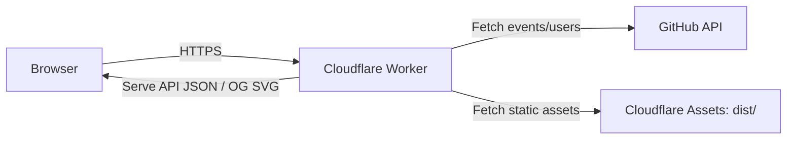
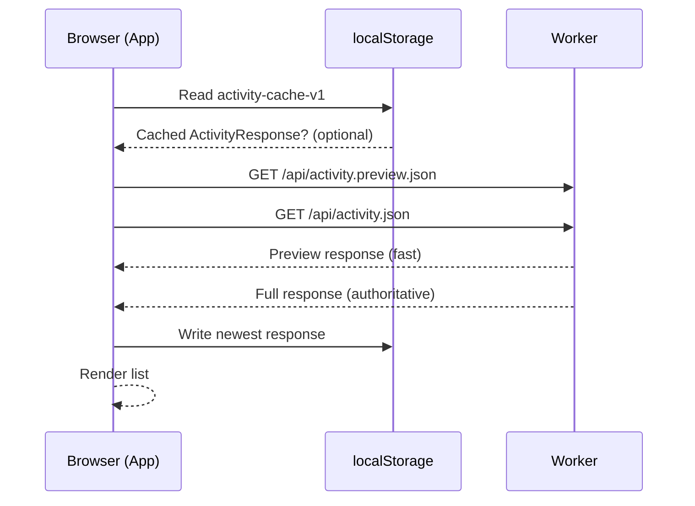
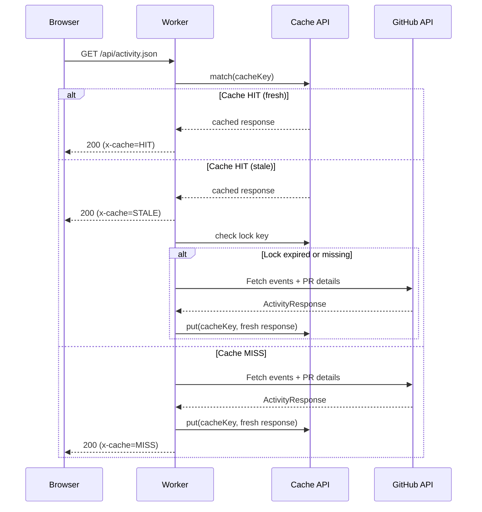
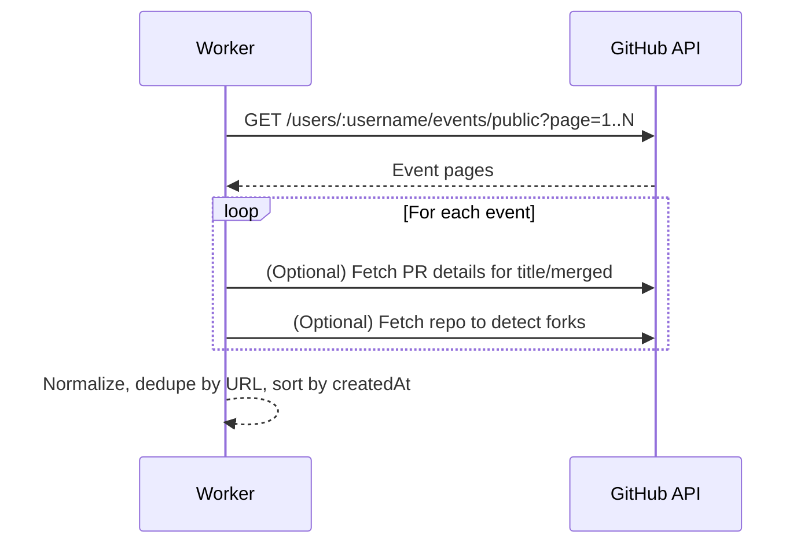
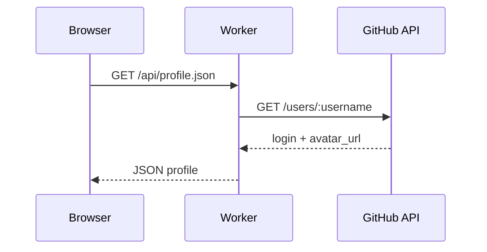
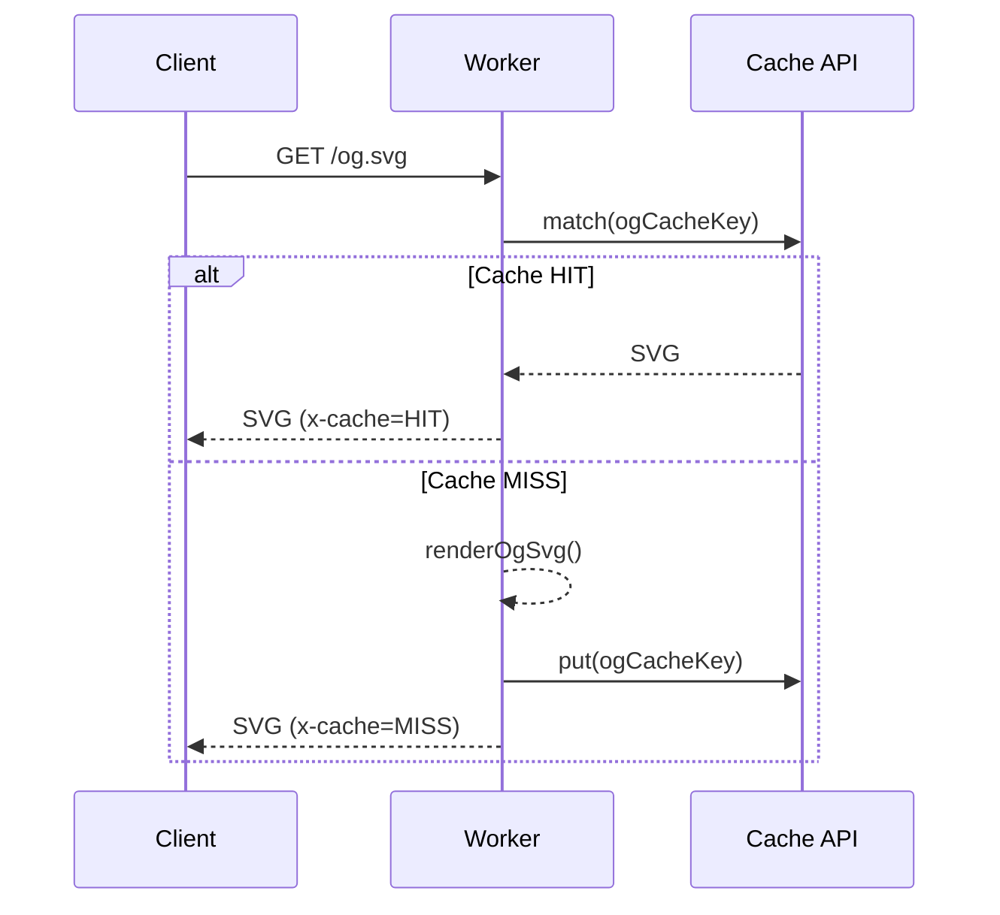

# Architecture Overview

This document summarizes the architecture and key flows of `activity.2k36.org`.

## System Context

- Frontend: React + Vite + TypeScript + Tailwind CSS.
- Backend: Cloudflare Worker that serves both API endpoints and static assets.
- External dependency: GitHub public events API.

## Repository Layout (Key Files)

- `src/main.tsx`: React entrypoint.
- `src/App.tsx`: data fetching, local cache, and page layout.
- `src/components/*`: activity list UI.
- `src/lib/activity/types.ts`: shared activity types (frontend copy).
- `worker/src/index.ts`: Worker routing and API handlers.
- `worker/src/github/events.ts`: GitHub API fetch + normalization.
- `worker/src/cache.ts`: edge cache keys and cache policy.
- `worker/src/og.ts`: OG SVG generation.
- `wrangler.toml`: Worker config and vars (`GITHUB_USERNAME`, `SITE_DOMAIN`).

## API Endpoints (Worker)

- `GET /api/activity.preview.json`
  - Fast, minimal normalization (single page of events).
- `GET /api/activity.json`
  - Full normalization (pagination + PR detail lookups).
- `GET /api/profile.json`
  - Basic GitHub user profile (login, avatar).
- `GET /og.svg`
  - Static OG image.

All endpoints are implemented in `worker/src/index.ts`.

## Data Model

Common response shape (duplicated in `src/lib/activity/types.ts` and
`worker/src/activity/types.ts`):

- `ActivityResponse`:
  - `username`: target GitHub user
  - `generatedAt`: ISO timestamp
  - `items`: array of `ActivityItem`
- `ActivityItem`:
  - `id`, `kind`, `createdAt`, `actor`, `repo`, `title`, `url`
  - optional `summary`, `reviewState`

## Frontend Behavior (App)

`src/App.tsx` implements the UI data flow:

- Reads localStorage cache (`activity-cache-v1`) on mount.
- Requests `GET /api/profile.json` for avatar/login.
- Requests both:
  - `GET /api/activity.preview.json` (fast)
  - `GET /api/activity.json` (authoritative)
- Uses `generatedAt` to avoid overwriting newer data with older data.
- When full fetch fails:
  - Uses cached data (if available).
  - Otherwise shows an error panel.

## Edge Caching Strategy (Worker)

Implemented in `worker/src/cache.ts` and used by `worker/src/index.ts`.

- Cache policy: `max-age=180s`, `stale-while-revalidate=300s`.
- Uses Cache API (`caches.default`) with normalized cache keys.
- Adds `x-generated-at` header to responses.
- On stale responses:
  - Serves stale content immediately.
  - Triggers background refresh via `ctx.waitUntil(...)`.
  - Uses a short-lived lock key to avoid stampedes (~15s per PoP).

## Sequence Diagrams

### 1) Page Load + Activity Refresh

### 2) Worker Cache for /api/activity.json

### 3) GitHub Normalization (Full)

### 4) Profile Fetch

### 5) OG Image

## Important Behaviors / Constraints

- Only public GitHub events are available.
- Push/commit events are intentionally ignored.
- Fork repositories are filtered out (requires per-repo API check).
- Activity items are deduplicated by URL.
- Deep pagination can return GitHub 422; the worker treats this as "no more pages".

## Local Development

- Start Worker API: `pnpm worker:dev` (port 8787).
- Start frontend: `pnpm dev` (Vite proxy to Worker at `/api/*`).

## Deployment Notes

- `pnpm build` outputs `dist/` and is served by the Worker via `ASSETS`.
- `wrangler.toml` controls target user and domain:
  - `GITHUB_USERNAME` (default: `JohnTitor`)
  - `SITE_DOMAIN` (default: `activity.2k36.org`)
